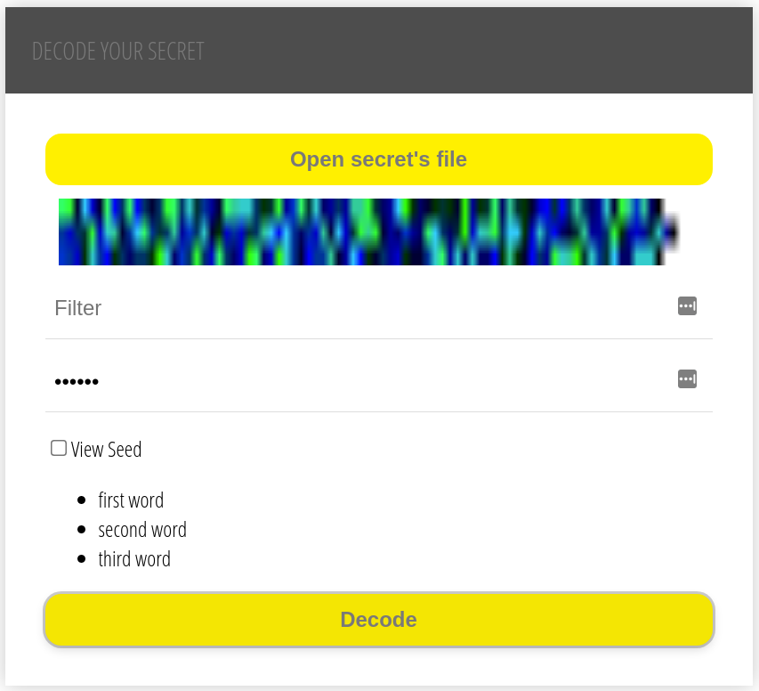

# WORD2PNGUI
This is an example of use the WASM decoder from the [world2png](https://github.com/theskyinflames/word2png#wasm) repo. Visit it for further information.

## How to run
`make run`

After that, go to http://localhost:9090/

## TODO
* Adding the encoding form

## Disclaimer
I've coded it only for fun. Please read the LICENSE. I hope you enjoy using it as much as I enjoyed building it. All ideas are welcome. Please let me know what you would add or change.
